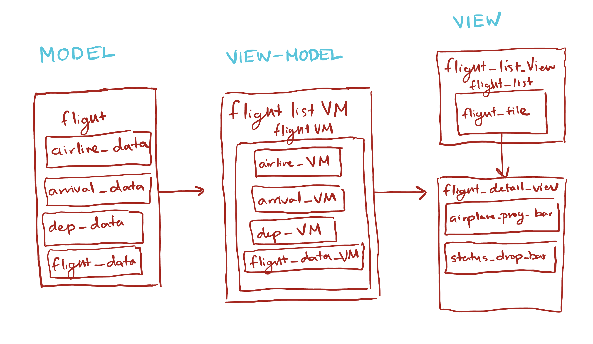

# CS1635 MPX: Flight Tracker 
**Theo Zervos, Ryan Armendariz-Lopez**

Our flight tracker app makes following flights simple and stress-free. Whether you’re waiting for a family member, planning your own trip, or just interested in aviation, the app lets you search by airline, flight number, or airport to view real-time departure and arrival information. Users can filter by flight status, track a flight’s current progress, and switch seamlessly between English and Spanish. Mobile-friendly and easy to use, the app consolidates all essential flight information in one place, so users can stay informed without juggling multiple websites.

APIs Used: AviationStack
Dependencies Used: Provider, Flutter Localizations, INTL, HTTP

# Getting an API Key

To get an API Key, you must visit https://aviationstack.com/, select "Get FreeAPI KEY", register yourself with AvationStack, and confirm your email.

# Creating a `.env` File with an `API_KEY`

Follow these steps to create and configure a `.env` file for your Flutter project.

## 1. Create the `.env` File

In the root directory of your project, create a new file named:

```
.env
```

Your folder structure should look like:

```
mpx/
  .env
  lib/
  pubspec.yaml
```

## 2. Add Your Environment Variable

Open the `.env` file and define your API key:

```
API_KEY=your_api_key_here
```

### Notes:

* Do **not** use quotes around the value.
* Keep the format `KEY=value` with no spaces.
* You can add multiple keys if needed.

## 3. Add `.env` to `.gitignore`

To prevent accidentally committing your API key, add this to your `.gitignore`:

```
.env
.env.*
```
# MVVM Diagram




